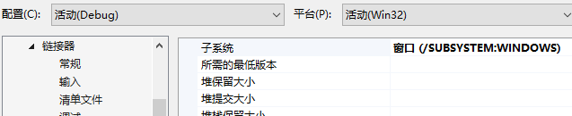
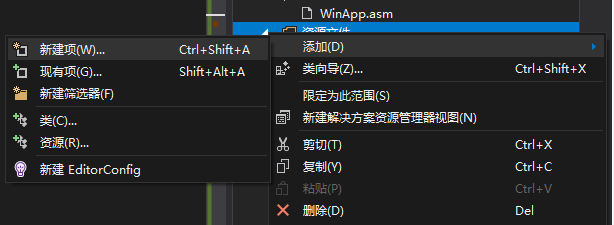
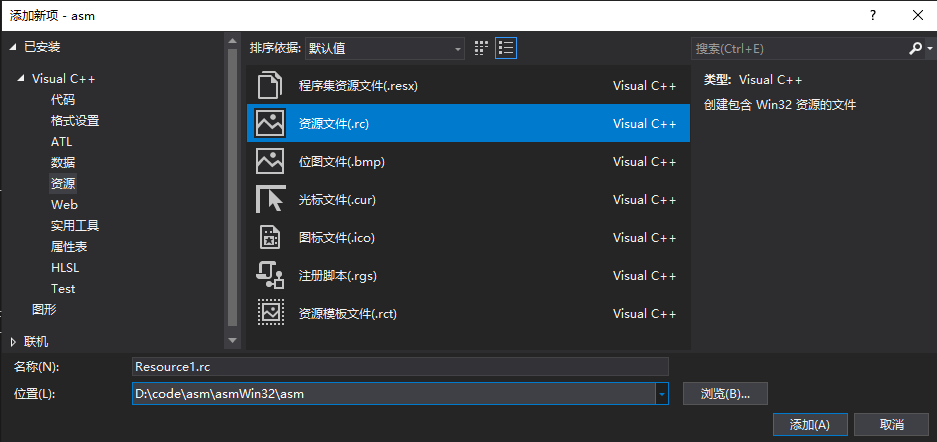
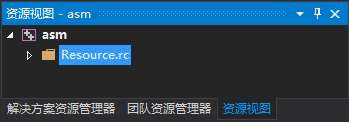
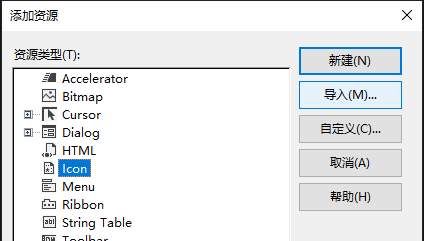
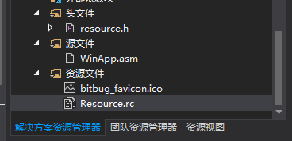
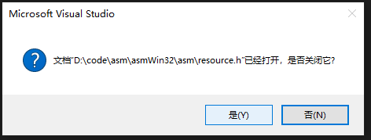
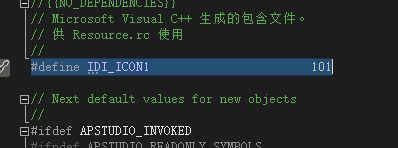
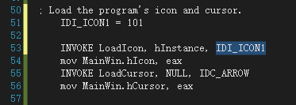

## Win32窗口程序运行说明

首先需要配置好命令行版本VS+汇编环境，还需要做以下修改：

**项目上右键——属性——配置属性——Microsoft Macro Assembler——General——Include Paths**，除了 masm32目录下的include目录 还要添加 **Irvine32的文件夹**（否则会找不到`Irvine32.inc`等文件）：

**项目上右键——属性——配置属性——链接器——系统——子系统**，选择**窗口**：

汇编程序使用`WinApp.asm`（可以到[云盘](https://cloud.tsinghua.edu.cn/lib/683d4601-51a4-41e5-bb62-e697272f7793/file/%E6%B1%87%E7%BC%96win10/masm_code_example/WinApp.asm)下载，也已经传到网络学堂上）。

### 资源文件加载

**资源文件**上面右键，新建项，选择**资源——资源文件(.rc)**

之后双击rc文件，会打开资源视图：

rc文件上右键——添加资源，选择对应的类型，选择导入（这里以ico文件为例），选择自己想要导入的文件即可：

再次切换到解决方案资源管理器标签页，可以看到：

刚才添加的ico文件会出现在这里，并且会有一个`resource.h`文件，双击打开（如果提示已经打开，则点“是”）可以看到一个宏定义，我们需要在`asm`文件中使用同样的数字来指代对应的资源（如图中的101）：

使用时可以在`asm`文件中添加`IDI_ICON1 = 101`一行，并且在合适位置调用（如加载icon，作为程序的图标）：

