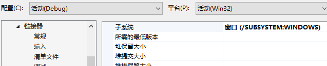

# Win32窗口程序运行说明

[TOC]

该文档源文件在[GitHub](https://github.com/fengh16/THSS_Assembly/tree/master/doc)，大家可以直接在GitHub上提PR来改进该文档。

## 环境配置

首先需要配置好命令行版本VS+汇编环境，还需要修改子系统为“窗口”，具体操作是：

**项目上右键——属性——配置属性——链接器——系统——子系统**，选择**窗口**：



<div style="page-break-after:always"></div>

## 相关说明

1. 请首先阅读课本第七版第11章《MS-Windows编程》，特别是：
     - 表11-1：MS-Windows和MASM的类型转换；
2. 程序中会使用Win32 API（官方教程在：https://learn.microsoft.com/zh-cn/windows/win32/api/ ），可以参考该官方教程及第七版课本第11章《MS-Windows编程》的内容，在汇编中通过函数调用的方法调用这些API。
   - 需要找某些功能时，请在搜索引擎中搜索【Win32API 功能名】。比如，要调用画图功能，请搜索【Win32API 画图】。
3. 在Win32窗口程序实现某些功能时，一般**不需要使用中断**。
     - 例如：**不要**使用`int 10h`在Win32窗口程序中画图（一个例子是 https://blog.csdn.net/qq_40298054/article/details/84496944 ，请务必注意这里的程序是**运行在DOSBox中的**，不是Win32窗口程序！！）
4. 如果子系统选择控制台，会导致运行时多出一个黑框，但不会有别的影响。
4. 很多结构和函数的定义在`windows.inc`中都有，可以直接用。**但是`windows.inc`及一些其他的masm32中自带的inc文件与`Irvine32.inc`和`GraphWin.inc`不兼容，大家可以参考下文中`WinApp_v2.asm`中include文件的方式。**

<div style="page-break-after:always"></div>

## 示例程序

### 程序1-WinApp.asm

汇编程序使用`WinApp.asm`（可以到[云盘](https://cloud.tsinghua.edu.cn/f/6b72319d570e4cf78610/)下载，也已经传到网络学堂上）。其内容对应于教材（第7版）第11.2.6节代码，可以打开窗口，显示提示框，并在退出程序时有所提示。其中用到了`Irvine32.inc`和`GraphWin.inc`，这两个文件都在`Irvine`文件夹中。

```assembly
TITLE Windows Application                   (WinApp.asm)

; This program displays a resizable application window and
; several popup message boxes.
; Thanks to Tom Joyce for creating a prototype
; from which this program was derived.
; Last update: 9/24/01

INCLUDE Irvine32.inc
INCLUDE GraphWin.inc

;==================== DATA =======================
.data

AppLoadMsgTitle BYTE "Application Loaded",0
AppLoadMsgText  BYTE "This window displays when the WM_CREATE "
	            BYTE "message is received",0

PopupTitle BYTE "Popup Window",0
PopupText  BYTE "This window was activated by a "
	       BYTE "WM_LBUTTONDOWN message",0

GreetTitle BYTE "Main Window Active",0
GreetText  BYTE "This window is shown immediately after "
	       BYTE "CreateWindow and UpdateWindow are called.",0

CloseMsg   BYTE "WM_CLOSE message received",0

ErrorTitle  BYTE "Error",0
WindowName  BYTE "ASM Windows App",0
className   BYTE "ASMWin",0

; Define the Application's Window class structure.
MainWin WNDCLASS <NULL,WinProc,NULL,NULL,NULL,NULL,NULL, \
	COLOR_WINDOW,NULL,className>

msg	      MSGStruct <>
winRect   RECT <>
hMainWnd  DWORD ?
hInstance DWORD ?

;=================== CODE =========================
.code
WinMain PROC
; Get a handle to the current process.
	INVOKE GetModuleHandle, NULL
	mov hInstance, eax
	mov MainWin.hInstance, eax

; Load the program's icon and cursor.
	INVOKE LoadIcon, NULL, IDI_APPLICATION
	mov MainWin.hIcon, eax
	INVOKE LoadCursor, NULL, IDC_ARROW
	mov MainWin.hCursor, eax

; Register the window class.
	INVOKE RegisterClass, ADDR MainWin
	.IF eax == 0
	  call ErrorHandler
	  jmp Exit_Program
	.ENDIF

; Create the application's main window.
; Returns a handle to the main window in EAX.
	INVOKE CreateWindowEx, 0, ADDR className,
	  ADDR WindowName,MAIN_WINDOW_STYLE,
	  CW_USEDEFAULT,CW_USEDEFAULT,CW_USEDEFAULT,
	  CW_USEDEFAULT,NULL,NULL,hInstance,NULL
	mov hMainWnd,eax

; If CreateWindowEx failed, display a message & exit.
	.IF eax == 0
	  call ErrorHandler
	  jmp  Exit_Program
	.ENDIF

; Show and draw the window.
	INVOKE ShowWindow, hMainWnd, SW_SHOW
	INVOKE UpdateWindow, hMainWnd

; Display a greeting message.
	INVOKE MessageBox, hMainWnd, ADDR GreetText,
	  ADDR GreetTitle, MB_OK

; Begin the program's message-handling loop.
Message_Loop:
	; Get next message from the queue.
	INVOKE GetMessage, ADDR msg, NULL,NULL,NULL

	; Quit if no more messages.
	.IF eax == 0
	  jmp Exit_Program
	.ENDIF

	; Relay the message to the program's WinProc.
	INVOKE DispatchMessage, ADDR msg
    jmp Message_Loop

Exit_Program:
	  INVOKE ExitProcess,0
WinMain ENDP

;-----------------------------------------------------
WinProc PROC,
	hWnd:DWORD, localMsg:DWORD, wParam:DWORD, lParam:DWORD
; The application's message handler, which handles
; application-specific messages. All other messages
; are forwarded to the default Windows message
; handler.
;-----------------------------------------------------
	mov eax, localMsg

	.IF eax == WM_LBUTTONDOWN		; mouse button?
	  INVOKE MessageBox, hWnd, ADDR PopupText,
	    ADDR PopupTitle, MB_OK
	  jmp WinProcExit
	.ELSEIF eax == WM_CREATE		; create window?
	  INVOKE MessageBox, hWnd, ADDR AppLoadMsgText,
	    ADDR AppLoadMsgTitle, MB_OK
	  jmp WinProcExit
	.ELSEIF eax == WM_CLOSE		; close window?
	  INVOKE MessageBox, hWnd, ADDR CloseMsg,
	    ADDR WindowName, MB_OK
	  INVOKE PostQuitMessage,0
	  jmp WinProcExit
	.ELSE		; other message?
	  INVOKE DefWindowProc, hWnd, localMsg, wParam, lParam
	  jmp WinProcExit
	.ENDIF

WinProcExit:
	ret
WinProc ENDP

;---------------------------------------------------
ErrorHandler PROC
; Display the appropriate system error message.
;---------------------------------------------------
.data
pErrorMsg  DWORD ?		; ptr to error message
messageID  DWORD ?
.code
	INVOKE GetLastError	; Returns message ID in EAX
	mov messageID,eax

	; Get the corresponding message string.
	INVOKE FormatMessage, FORMAT_MESSAGE_ALLOCATE_BUFFER + \
	  FORMAT_MESSAGE_FROM_SYSTEM,NULL,messageID,NULL,
	  ADDR pErrorMsg,NULL,NULL

	; Display the error message.
	INVOKE MessageBox,NULL, pErrorMsg, ADDR ErrorTitle,
	  MB_ICONERROR+MB_OK

	; Free the error message string.
	INVOKE LocalFree, pErrorMsg
	ret
ErrorHandler ENDP

END WinMain
```


### 程序2-WinApp_v2.asm

基于`WinApp.asm`修改得到的程序`WinApp_v2.asm`（可以到[云盘](https://cloud.tsinghua.edu.cn/f/62af28f0e4b24b60b88c/)下载，也已经传到网络学堂上）。使用`windows.inc`而非`Irvine32`和`GraphWin`。

```assembly
TITLE Windows Application                   (WinApp_v2.asm)

; Another version of WinApp.asm
; Modified by: HenryFox
; Last update: 10/13/21
; Original version uses Irvine32 and GraphWin, this version uses windows.inc

; This program displays a resizable application window and
; several popup message boxes.
; Thanks to Tom Joyce for creating a prototype
; from which this program was derived.

.386
.model flat, stdcall
option casemap: none

include         windows.inc
include         gdi32.inc
includelib      gdi32.lib
include         user32.inc
includelib      user32.lib
include         kernel32.inc
includelib      kernel32.lib
include         masm32.inc
includelib      masm32.lib
include         msvcrt.inc
includelib      msvcrt.lib
include         shell32.inc
includelib      shell32.lib

;------------------ Structures ----------------

WNDCLASS STRUC
  style           DWORD ?
  lpfnWndProc     DWORD ?
  cbClsExtra      DWORD ?
  cbWndExtra      DWORD ?
  hInstance       DWORD ?
  hIcon           DWORD ?
  hCursor         DWORD ?
  hbrBackground   DWORD ?
  lpszMenuName    DWORD ?
  lpszClassName   DWORD ?
WNDCLASS ENDS

MSGStruct STRUCT
  msgWnd        DWORD ?
  msgMessage    DWORD ?
  msgWparam     DWORD ?
  msgLparam     DWORD ?
  msgTime       DWORD ?
  msgPt         POINT <>
MSGStruct ENDS

MAIN_WINDOW_STYLE = WS_VISIBLE+WS_DLGFRAME+WS_CAPTION+WS_BORDER+WS_SYSMENU \
	+WS_MAXIMIZEBOX+WS_MINIMIZEBOX+WS_THICKFRAME

;==================== DATA =======================
.data

;后续部分与WinApp.asm一致
```

<div style="page-break-after:always"></div>

## 资源文件加载

**资源文件**上面右键，新建项，选择**资源——资源文件(.rc)**


之后双击rc文件，会打开资源视图：


rc文件上右键——添加资源，选择对应的类型，选择导入（这里以ico文件为例），选择自己想要导入的文件即可：


再次切换到解决方案资源管理器标签页，可以看到：


刚才添加的ico文件会出现在这里，并且会有一个`resource.h`文件，双击打开（如果提示已经打开，则点“是”）可以看到一个宏定义，我们需要在`asm`文件中使用同样的数字来指代对应的资源（如图中的101）：


使用时可以在`asm`文件中添加`IDI_ICON1 = 101`一行，并且在合适位置调用（如加载icon，作为程序的图标）：


<div style="page-break-after:always"></div>

## 汇编中相关函数查找示例

先确认Win32 API中的对应函数名，比如需要用到`TransparentBlt`，可以这样查找对应的`inc`和`lib`文件：

在你的masm32安装路径中的`include`文件夹（如：`C:\masm32\include`）中搜索该内容，记得搜索中高级选项选中“文件内容”：


在搜出的`inc`文件中，确认有这个查找的函数：


因为这个文件名是`msimg32`，因此在代码中`include msimg32.inc`并`includelib msimg32.lib`即可。

<div style="page-break-after:always"></div>

## Win32API相关功能查找示例

建议在 https://learn.microsoft.com/en-us/windows/win32 搜索相关功能，比如如果想创建ToolBar，直接搜索ToolBar：


这个[How to Create Toolbars - Win32 apps | Microsoft Learn](https://learn.microsoft.com/en-us/windows/win32/controls/create-toolbars)就是你需要的。可以将里面给的代码示例改为汇编形式，如：

```c++
HWND hWndToolbar = CreateWindowEx(0, TOOLBARCLASSNAME, NULL, 
                                  WS_CHILD | TBSTYLE_WRAPABLE, 0, 0, 0, 0, 
                                  hWndParent, NULL, g_hInst, NULL);
```

改成：

```assembly
invoke CreateWindowEx, 0, addr TOOLBARCLASSNAME, NULL, \
                       WS_CHILD or TBSTYLE_WRAPABLE, 0, 0, 0, 0, \
                       hWnd, NULL, hInstance, NULL
mov hWinToolBar,eax
```

这里的TOOLBARCLASSNAME可以根据说明


找到[Window Classes (CommCtrl.h) - Win32 apps | Microsoft Learn](https://learn.microsoft.com/en-us/windows/win32/controls/common-control-window-classes)，然后打开本机的相应文件（如：`C:\Program Files (x86)\Windows Kits\10\Include\10.0.18362.0\um\CommCtrl.h`），找到定义：


因此，需要在代码里面提前写：

```assembly
TOOLBARCLASSNAME BYTE "ToolbarWindow32",0
```

