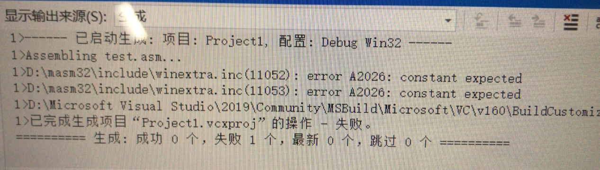
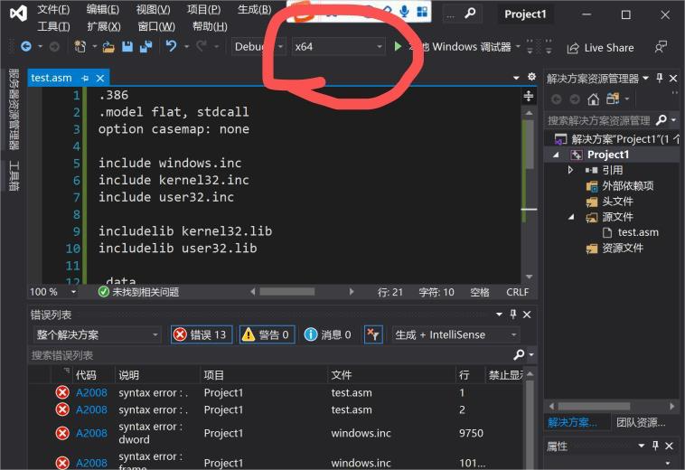

# 汇编环境配置说明

**请注意：汇编环境需要在Windows系统下进行配置，如果使用macOS或Linux操作系统，请使用虚拟机或双系统配置Windows环境，或者借用同学的Windows设备！**

相关文件可以到 https://cloud.tsinghua.edu.cn/d/4e21272535c848808ede/ 下载。该文档源文件在[GitHub](https://github.com/fengh16/THSS_Assembly/tree/master/doc)，大家可以直接在GitHub上提PR来改进该文档。

- `VirtualBoxOVA`文件夹：虚拟机ova文件（适用于Virtual Box，全部下载后解压得到`Win10_64.ova`文件）
  - 解压时需要将`.zip.001`、`.zip.002`两个文件**都下载下来**放到**同一个**文件夹中，右键`.zip.001`文件解压
- `虚拟机磁盘文件`文件夹：上述虚拟机的磁盘文件，可用各种虚拟机软件挂载（需全部下载后解压）
- `masm_code_example`文件夹：几个示例程序：
  - `InputOutput.asm`及`InputOutput_crt.asm`：输入两个数字，输出他们的和；如果输入两个数字后一闪而过，可以在命令行中运行exe文件查看结果，或者在`InputOutput_crt.asm`打断点；
  - `AddSubAlt.asm`：加法与减法示例，计算`10000h+40000h-20000h`并且打印寄存器内容。没有输入环节，不设置断点可能会一闪而过；
  - `MessageBox.asm`：弹出一个HelloWorld提示框的程序；
  - `项目中使用多个asm文件的例子.zip`：项目中使用多个asm文件的例子，包含两个`asm`文件和一个`inc`文件；
  - `WinApp.asm`及`WinApp_v2.asm`：一个【Win32窗口】示例程序，两者引用的包存在区别
- `masm手动安装`文件夹：若masm32安装出错，可以按照其中的说明进行手动安装
- `Irvine.rar`：Irvine32及其他文件
- `m32v11w10.zip`：masm32的安装包
- `Visual_Studio_Premium_2012_ChnSimp.ISO`：info上的VS 2012安装包
- `VirtualBox-6.1.14-140239-Win.exe`：Windows版本的Virtual Box安装包
- `汇编环境配置说明.pdf`：此说明文档的最新版本
- `高亮插件`文件夹：汇编语法高亮插件，说明参见FAQ第20条
- `Win32窗口程序运行说明.pdf`：一个Win32窗口示例程序的运行说明，对应代码是`WinApp.asm`及`WinApp_v2.asm`

可以直接使用提供的虚拟机文件（直接修改已有项目的代码即可）；也可以按照配置方法（`Win10汇编+VS环境配置`一节），自行配置VS+汇编的环境。

**目录**

[TOC]

## Win10汇编+VS环境配置

如果不使用虚拟机，可以用如下方式进行安装与配置。本节配置完后可以运行命令行程序。

以下过程参考了 https://blog.csdn.net/u013761036/article/details/52186683 。

### MASM32安装

下载`m32v11w10`，解压后安装（点击地球图标，出现Select the Installation Partition的时候，选中列表里面第一项（C盘），选择`OK`）


之后会进行一系列测试，一直下一步/确定即可。


在这一步的时候点击`Extract`，接下来点击确定，弹出的控制台窗口结束之后，会弹出成功提示：


直接按下任意键即可。接下来一路确定/Yes/OK。

弹出下列窗口表示已经安装完成：


### Irvine32

解压到电脑上任意文件夹中即可，之后会在VS中作为附加依赖项加入。

### VS中配置

下载安装VS（默认选项直接安装即可，使用学校提供的Premium 2012成功）

打开VS，新建项目（其他项目类型——Visual Studio解决方案——空白解决方案）


<div style="page-break-after:always"></div>

解决方案上右键——添加——新建项目


选择Visual C++——空项目


项目上右键——生成自定义


- 【注】：如果是新版本的VS，这一项在 右键——生成依赖项——生成自定义
  - 

<div style="page-break-after:always"></div>

选中masm


**项目上**右键——添加——新建项，选择C++文件，后缀改用asm


<div style="page-break-after:always"></div>

**项目**（不是asm文件）**上右键——属性——配置属性——链接器——常规**，选择附加库目录，添加 masm32目录下的lib目录：


*项目上右键——属性——配置属性——链接器——* **输入**，选择附加依赖项，添加`Irvine32.lib`以及一些自己所需的额外的依赖lib文件（Irvine文件夹下只需要添加`Irvine32.lib`）：


*项目上右键——属性——配置属性——链接器——* **系统——子系统**，选择控制台：


<div style="page-break-after:always"></div>

*项目上右键——属性——配置属性——* **Microsoft Macro Assembler——General——Include Paths**，添加 masm32目录下的include目录：


打开刚才创建的`asm`文件，输入以下代码（可以到[云盘](https://cloud.tsinghua.edu.cn/f/c8572278c9a141c1a42c/)下载）：

```assembly
.386
.model flat, stdcall
option casemap: none

include windows.inc
include kernel32.inc
include user32.inc

includelib kernel32.lib
includelib user32.lib

.data
szCaption db "Hello", 0
szText    db "Hello World!", 0

.code

main PROC
    INVOKE MessageBox, NULL, addr szText, addr szCaption, MB_OK
    INVOKE ExitProcess, 0
main ENDP

END main
```

<div style="page-break-after:always"></div>

点击本地Windows调试器，选择“是”生成项目，弹出提示框即说明正常。如果遇到`winextra.inc`相关报错，请参考FAQ第5条。


<div style="page-break-after:always"></div>

### 使用技巧与注意事项

1. 出现问题时可以先查看本文档最后FAQ部分，看有没有相关的解决方法。若没有发现相关的问题或无法解决，可以微信询问助教。

1. 调试的时候（程序**正在运行**时），调试——窗口——寄存器（图中最下面一个选项） 可以打开寄存器窗口。

   

2. VS中汇编高亮插件详见[云盘中高亮插件文件夹](https://cloud.tsinghua.edu.cn/d/44fff71e209449c194e2/)，说明参见FAQ第20条。

3. 如果安装masm32时出错：DELETE operation of EXE file has failed：参见FAQ部分第1条。

4. 如果运行出错，可能是编码问题，需检查代码**是否为`GB2312`编码**，参见FAQ部分第2-4条。

5. 如果出现`A2026 constant expected`错误等`winextra.inc`相关错误，可以参考FAQ部分第5条。

6. 如果无法命中断点，请确认断点设置在**一个`PROC`中**，详见FAQ部分第10条。

8. 一个VS的Project中**只应有一个带有入口的`asm`文件**，【勿将示例代码多个`asm`文件全部放入同一个Project中】。如果需要在项目中使用多个文件，请参考[项目中使用多个asm文件的例子.zip](https://cloud.tsinghua.edu.cn/f/e50fdd9357bb41dfa1ce/)文件中的做法，具体详见FAQ部分第21条。

9. Win32窗口程序相关说明见后面一页。

10. 如果需要用到C系统库函数，可以使用`msvcrt.inc`里面的函数，可以参考FAQ第18条。这里面有很多相关函数，如`crt_rand`、`crt_srand`、`crt_sprintf`、`crt_time`等，用法都和C语言中的对应函数一样，返回值会放在`eax`里。

11. 如果需要命令行生成可执行文件，可以参考FAQ第22条。

12. 相关链接：

    1. Assembly Language for x86 Processors, 8/e (asmirvine.com)：https://asmirvine.com/
    2. Irvine：
       1. Irvine Library Help (csudh.edu)：https://csc.csudh.edu/mmccullough/asm/help/
       2. Eazybright/Irvine32: A library for assembly language：https://github.com/Eazybright/Irvine32
    3. Win32 API 编程参考 - Win32 apps | Microsoft Learn：https://learn.microsoft.com/zh-cn/windows/win32/api/


<div style="page-break-after:always"></div>

## Win32窗口程序

**本节内容适用于【窗口】程序，如果只需要运行命令行程序，请勿执行本节的步骤**

具体说明及Win32 API相关资料的一些说明见[Win32窗口程序运行说明.pdf](https://cloud.tsinghua.edu.cn/f/f62940a0651543d4a83d/)。以下为运行的关键步骤：

**项目上右键——属性——配置属性——Microsoft Macro Assembler——General——Include Paths**，除了 masm32目录下的include目录 还要添加 **Irvine32的文件夹**（否则会找不到`Irvine32.inc`等文件）：


**项目上右键——属性——配置属性——链接器——系统——子系统**，选择**窗口**：


汇编程序使用`WinApp.asm`（可以到[云盘](https://cloud.tsinghua.edu.cn/f/6b72319d570e4cf78610/)下载）。

<div style="page-break-after:always"></div>

## 虚拟机使用

本节内容旨在用虚拟机的方式配置环境。如果已经按照上文配置完成，无需看本节内容，也不用管ova文件和虚拟机磁盘文件。

下载链接（Virtual Box 6.1.14版本）：

- Windows：https://download.virtualbox.org/virtualbox/6.1.14/VirtualBox-6.1.14-140239-Win.exe
- Mac：https://download.virtualbox.org/virtualbox/6.1.14/VirtualBox-6.1.14-140239-OSX.dmg
- Linux：https://www.virtualbox.org/wiki/Linux_Downloads

安装的时候直接默认设置一直下一步就行，安装完成后把ova格式的虚拟机文件（Win10_64.ova，可从[云盘](https://cloud.tsinghua.edu.cn/d/74f6aa0bbec84799a36c/)下载）导入：


启动之后，在这个虚拟机的设置中：

- 存储——删除`VBoxGuestAdditions.iso`文件
- 系统——调整内存大小等配置【注：内存设置过大，可能会导致系统卡死，设置为3GB即足够，不要超过本机内存50%】

之后即可启动，可能会遇到 硬件虚拟化 相关的问题：

- VirtualBox6需要开启硬件虚拟化才可以使用，如果在启动虚拟机时遇到如图的错误，则需要禁用硬件加速中硬件虚拟化/在BIOS中开启硬件虚拟化：
  - 
  - 一个可能的解决方案见 https://blog.csdn.net/haibo0668/article/details/101716875 ，如果无法取消勾选“硬件加速”，则需要先开启硬件虚拟化，方法见 https://jingyan.baidu.com/article/ab0b56305f2882c15afa7dda.html 、 https://jingyan.baidu.com/article/e2284b2bba4804e2e7118d5f.html 。

建议在导入之后，开启共享粘贴板与拖放，方便与主机进行文件交换，如图：


打开虚拟机后，桌面上的test文件夹里面装着一些用于测试的汇编代码，可以直接打开其中的sln文件运行，如图所示：


`桌面\MASM_test`中的代码（分别对应于云盘中的三个示例代码）：

- `test`：弹出一个Hello World的Message Box的程序；
- `InputOutput`：输入两个数字，计算并输出他们的和的程序*（代码中注释写错了）*；
- `AddSubAlt`：加法与减法的示例程序。

如果有时候无法正常生成可执行文件/无法正常运行，可以尝试一下 生成——清理解决方案。

<div style="page-break-after:always"></div>

## FAQ

1. 【安装错误】安装masm32时出错：DELETE operation of EXE file has failed:

   - 
   - 需要注意关掉防病毒软件和[系统保护](https://jingyan.baidu.com/article/1709ad80519e564634c4f0c8.html)，网上一些解决方案见：
     - win10中masm32安装出现问题？ - 知乎 https://www.zhihu.com/question/65735757/
     - https://ask.csdn.net/questions/219018
   - 如果上述方法不行，可以考虑[手动安装masm](https://cloud.tsinghua.edu.cn/f/54bb3f4c1a9a4237a6d5/)（下载[压缩包](https://cloud.tsinghua.edu.cn/f/ccbfd0fe78db412b9839/)后解压到`C:\masm32`，运行`C:\masm32\makelibs.bat`）

2. 【编码相关】使用的是什么文件编码？

   - 示例代码使用Windows中文版的默认编码`GB2312`，但可以用别的编码的源文件交作业。

3. 【编码相关】Invalid character in file：

   - 可能因为编码问题/空格格式等问题导致。
   - 请尝试直接**复制**云盘上的[示例代码文件](https://cloud.tsinghua.edu.cn/d/8e0a65b18f6146c1ae30/)到项目中**覆盖**掉自己创建的asm文件，而不是直接复制`pdf`的内容 或 手动复制`asm`文件的内容。请注意文件编码为`GB2312`。

4. 【编码相关】网上的asm代码可以运行，但修改后不可以：

   - 注意保存的代码文件应该为GB2312编码，请勿使用UTF-8编码。

   - 可以使用 https://blog.csdn.net/qq_15647227/article/details/83449248 里面的说明将文件保存为GB2312格式；若还有错误，请使用VSCode、记事本等编辑器进行编辑。

     

5. 【运行错误】报错`error A2026: constant expected`、`undefined symbol: NLEN`（出错的文件是`winextra.inc`）：

   - 

   - 

   - 解决方案A： https://blog.csdn.net/zhanghaishan/article/details/111201645?spm=1001.2014.3001.5501 （感谢@孙沛瑜）

   - 解决方案B：双击这里的`error A2026: constant expected`这一句，可以打开`winextra.inc`文件（如果弹出警告框提示“保存该文件将不会保留原始文件内容”，可以直接确定）：

     - 11050行至11054行应当为：

       - ```assembly
         STD_ALERT struct
             alrt_timestamp dd ?
             alrt_eventname WCHAR  EVLEN + 1 dup(?)
             alrt_servicename WCHAR SNLEN + 1 dup(?)
         STD_ALERT ends
         ```

     - 如果打开后发现错误是在这几行，可以把打开的文件这几行修改为上述上述代码，例如：

       - 
       - 去掉11052和11053行的两对中括号并保存，重新尝试生成可执行程序并运行即可。

6. 【运行错误】提示一堆`syntax error`：

   - 
   - 解决：一般是运行的选项不对，将上图修改为`x86`而非`x64`，之后**重新设置项目属性**即可。

7. 【运行错误】提示无法解析的外部符号`_printf`：

   - 请将masm32安装到C盘，手动安装的话需要解压到`C:\masm32`文件夹。如果不是的话，可以重新安装尝试。

8. 【运行错误】修改为Release模式无法正常运行：

   - 要注意属性配置时，默认可能是Debug模式的设置，需要手动切换一下：

     

9. 【配置问题】配置过程中，右键得到的属性菜单没有找到配置中需要的项目：

  - 
  - 需要在**项目**上右键，而不是在**asm**文件上右键。

10. 【调试&运行相关】无法命中断点：

  - 请检查代码写法。如代码示例`InputOutput.asm`（见[网盘](https://cloud.tsinghua.edu.cn/f/48985d098dec41ac9d81/)）中，`start`部分的写法如下：

    ``` assembly
    .code
    start:
                    invoke  printf, offset szMsg  ; 调用printf
                    ...
                    ret
    end				start
    ```

  - 将其改写成：

    ```assembly
    .code
    start PROC
                    invoke  printf, offset szMsg  ; 调用printf
                    ...
                    ret
    start ENDP
    end				start
    ```

    即可命中`start PROC`到`start ENDP`内部的断点。

11. 【调试&运行相关】找不到寄存器窗口选项：

     - 寄存器窗口选项只有在程序运行时（比如：等待输入、命中断点）才会出现。如果未运行程序，则没有打开寄存器的选项。

12. 【调试&运行相关】汇编程序闪退：

   - 可能是因为没有设置断点，可以设置断点尝试一下。
   - 可以在 sln文件同级目录下，找到Debug文件夹中的exe文件，在命令行窗口中运行该文件，即可避免闪退问题。

13. 【调试&运行相关】VS中汇编项目生成的`exe`位置&测试方法：

     - `exe`位置在 与`sln`在同一个文件夹的 `Debug`目录下，即下图所示的`Debug`目录下： 

       - 

     - 测试时，使用命令行窗口运行exe文件：

       - 打开包含exe文件的文件夹，地址栏输入`cmd`回车进入控制台界面，输入`exe`文件名称回车执行：

         

14. 【调试&运行相关】小作业提交的`exe`文件需要特殊处理得到吗？

     - 直接用VS运行asm代码，Debug/Release模式得到的exe均可直接提交，暂时没有发现需要特殊处理的地方，若有问题助教会联系你的~

15. 【虚拟机相关】虚拟机无法加载/导入：

      - 请检查是否正确解压（云盘上为分卷压缩文件，需要将`.zip.001`和`.zip.002`文件放到同一个文件夹下，在`.zip.001`文件上右键解压），`ova`文件和`vhd`文件均为8G左右。若仍出错，请联系助教。

16. 【虚拟机相关】ova文件导入时`NS_ERROR_INVALID_ARG`：

      - 请检查 虚拟介质管理器 中是否有叹号设备，有的话删除可能可以正常导入。若仍出错，请联系助教。

17. 【虚拟机相关】虚拟机运行慢：

     - 请检查虚拟机内存分配设置，分配2G内存以上，不要超过本机内存50%。

18. 【函数使用相关】关于`printf`、`crt_printf`的参数：

    - 这几个函数的参数和C语言中使用的`printf`参数一致，这代表着，如果需要打印一个数字，不能直接给`printf`传递一个数作为参数，应该先传递一个包含`%d`的字符串指针，再传递一个数作为参数。例子见示例代码[InputOutput_crt.asm](https://cloud.tsinghua.edu.cn/f/62e871b8cf1d4344bead/)。

19. 【找不到inc文件】在项目属性——配置属性——Microsoft Macro Assembler——General——Include Paths，已经添加想用的`inc`文件所在的目录（如：`masm32`目录下的`include`目录），但还是提示找不到inc文件：

    - 请检查填写的路径中是否包含你要include的inc文件路径；
    - 请检查`include`语句中写的`inc`文件文件名是否正确，比如字母`l`和`I`以及数字`1`很容易搞错；
    - 这里填写的路径应该是**包含`inc`文件的文件夹的路径**，而非`inc`文件的路径；
    - 请注意这里填写的内容是否包含不可见字符，比如：从文件属性页中直接复制路径，复制得到的结果中可能包含一个`\u2002a`字符
      - 

20. 【语法高亮】语法高亮插件在[云盘中高亮插件文件夹](https://cloud.tsinghua.edu.cn/d/44fff71e209449c194e2/)，包括`AsmHighlighter-VS2012.vsix`、`AsmHighlighter.vsix`、`AsmDude-vs2022-includefix.vsix`，分别适用于2012、2019、2022版本的VS，其中：

    - **2012版本**需要在安装后删除注册表`HKEY_CURRENT_USER\Software\Microsoft\VisualStudio\11.0\FontAndColors\Cache`文件夹并重新启动VS 2012。
    - **2022版本**来自@董文冲同学，如果有include解析不了，可以把include path从masm挪到vc include解析那个property里，因为这个include解析是他自己写的所以可能会有一点小问题。

21. 【多个asm文件的配置】请参考[项目中使用多个asm文件的例子.zip](https://cloud.tsinghua.edu.cn/f/e50fdd9357bb41dfa1ce/)文件中的做法，其中只能有一个文件存在程序入口点（类似于C语言中的`main`函数只能有一个）。例如：

    - `main.asm`文件中`include a.inc`：

      ```assembly
      .386
      .model flat,STDCALL
      option casemap:none
      
      includelib      msvcrt.lib
      include         msvcrt.inc
      include         a.inc
      
      .data
      szMsg			byte    "结果是%d", 0ah, 0dh, 0
      
      .code
      start PROC
      		invoke function_a
      		invoke crt_printf, offset szMsg, eax
      		ret
      start ENDP
      
      end				start
      ```

    - `a.inc`文件中包含声明：`function_a	PROTO`

    - `a.asm`文件中包含函数的具体实现（最后需要有一个`END`）：

      ```assembly
      .386
      .model flat,STDCALL
      option casemap:none
      
      include a.inc
      
      .code
      function_a PROC
          mov eax, 3
          ret
      function_a ENDP
      
      END
      ```

22. 【命令行中用masm生成可执行文件】如何命令行生成可执行文件？

    - 可以参考：ML and ML64 command-line reference | Microsoft Learn：https://learn.microsoft.com/en-us/cpp/assembler/masm/ml-and-ml64-command-line-reference?view=msvc-170

    - 首先定义环境变量`INCLUDE`，如下图：

      

    - 打开命令行，输入`set INCLUDE`检查一下是不是你需要的`include`文件夹；

    - 到代码文件夹下（这里使用[项目中使用多个asm文件的例子.zip](https://cloud.tsinghua.edu.cn/f/e50fdd9357bb41dfa1ce/)中的文件作为例子），依次输入：
    
      ```shell
      C:\masm32\bin\ml.exe /Fo main.obj /c /coff /Cp main.asm
      C:\masm32\bin\ml.exe /Fo a.obj /c /coff /Cp a.asm
      C:\masm32\bin\link.exe /subsystem:console main.obj a.obj C:\masm32\lib\msvcrt.lib
      main.exe
      ```
    
      